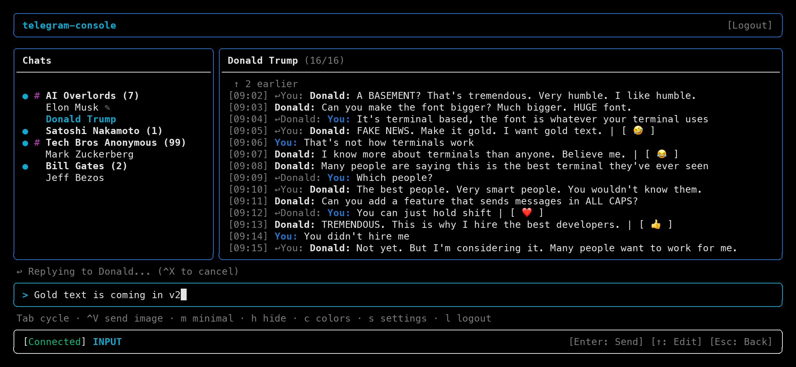

# telegram-console

<p align="center">
  
</p>

A terminal-based Telegram client for technical users. Seamlessly and discretely keep track of your group chats while you watch Claude do your job.

## Installation

```bash
npm install -g telegram-console
```

## Setup

### Step 1: Get Telegram API Credentials

Telegram allows third-party clients to access their platform through an official API. Unlike some services that require centralized API keys, Telegram's model lets each user generate their own credentials. This means:

- **You control your credentials** — your API ID and Hash are generated by you and stored only on your machine
- **No middleman** — this client connects directly to Telegram's servers using your credentials
- **Full transparency** — the code is open source, so you can verify exactly what data is sent

To get your credentials:

1. Go to [my.telegram.org](https://my.telegram.org/auth) and log in with your phone number
2. You'll receive a confirmation code in Telegram — enter it
3. Click on **"API development tools"**
4. Fill in the form:
   - **App title**: Any name (e.g., "My Console Client")
   - **Short name**: A short identifier (e.g., "console")
   - Platform, description, and other fields can be left as default
5. Click **"Create application"**
6. You'll see your **API ID** (a number) and **API Hash** (a string) — save these

> **Important**: Never share your API credentials. They are unique to your account and should be treated like a password.

By using the Telegram API, you agree to Telegram's [API Terms of Service](https://core.telegram.org/api/terms).

### Step 2: Run the Client

1. Run `telegram-console`
2. Enter your API ID and API Hash when prompted
3. Authenticate using one of these methods:
   - **QR Code** (default): Scan the QR code with Telegram mobile app (Settings → Devices → Link Desktop Device)
   - **Phone Code**: Enter your phone number and the code sent to your Telegram

## Usage

```bash
telegram-console
```

<p align="center">
  
</p>

### Keyboard Shortcuts

Press `?` in the app for the full list. `^` means Ctrl.

<!-- keymap:start (generated from src/keymap.ts by `bun run docs:keymap`) -->

#### Anywhere (except while typing)

| Key         | Action                             |
| ----------- | ---------------------------------- |
| `?`         | Show this help                     |
| `^K` `/`    | Go to chat (^K works while typing) |
| `Tab`       | Next panel                         |
| `Shift+Tab` | Previous panel                     |
| `s`         | Settings                           |
| `l`         | Log out                            |
| `m`         | Toggle minimal layout              |
| `h`         | Hide the screen; any key restores  |
| `c`         | Toggle colors                      |
| `^R`        | Retry whatever failed to load      |
| `^C`        | Quit                               |

#### Header

| Key     | Action              |
| ------- | ------------------- |
| `←→`    | Choose a button     |
| `Enter` | Activate the button |
| `Esc`   | Go to chats         |

#### Chats

| Key        | Action                         |
| ---------- | ------------------------------ |
| `↑↓` `j/k` | Move (←→ on narrow screens)    |
| `Enter`    | Open the chat and start typing |
| `→`        | Go to messages (wide screens)  |
| `Esc`      | Go to the header (full layout) |

#### Messages

| Key           | Action                             |
| ------------- | ---------------------------------- |
| `↑↓` `j/k`    | Select a message                   |
| `PgUp` `PgDn` | Page up / down                     |
| `g` `Home`    | Oldest loaded message              |
| `G` `End`     | Newest message                     |
| `r`           | React, or remove your reaction     |
| `R`           | Reply                              |
| `Enter`       | Open media, jump to reply, or type |
| `Enter`       | Oldest message: load older ones    |
| `Enter`       | Failed message: retry              |
| `x`           | Failed message: discard or undo    |
| `←` `Esc`     | Go to chats                        |

#### Typing

| Key              | Action                          |
| ---------------- | ------------------------------- |
| `Enter`          | Send                            |
| `Alt+Enter` `^J` | New line                        |
| `↑`              | Edit last message (empty input) |
| `↑↓`             | Move between lines              |
| `^X`             | Cancel reply or edit            |
| `^V`             | Send the image on the clipboard |
| `^A` `^E`        | Jump to start / end             |
| `Esc` `Tab`      | Leave the input; draft is kept  |

#### Reactions

| Key     | Action                             |
| ------- | ---------------------------------- |
| `←→`    | Choose (arrows in the full grid)   |
| `Enter` | React; on [...] open the full grid |
| `Esc`   | Cancel                             |

#### Media viewer

| Key           | Action          |
| ------------- | --------------- |
| `Space`       | Zoom            |
| `Arrows`      | Pan when zoomed |
| `Enter` `Esc` | Close           |

<!-- keymap:end -->

## Features

- View chat list (private chats + groups)
- Read messages
- Send text messages
- Unread indicators
- Connection status display
- Session persistence
- QR code + phone code authentication

## Configuration

Config file location: `~/.config/telegram-console/config.json`

### Environment Variables

| Variable          | Description                 |
| ----------------- | --------------------------- |
| `TG_API_ID`       | Telegram API ID             |
| `TG_API_HASH`     | Telegram API Hash           |
| `TG_SESSION_MODE` | `persistent` or `ephemeral` |
| `TG_AUTH_METHOD`  | `qr` or `phone`             |

## Contributing

Contributions are welcome! Feel free to open issues and pull requests.

## License

MIT
